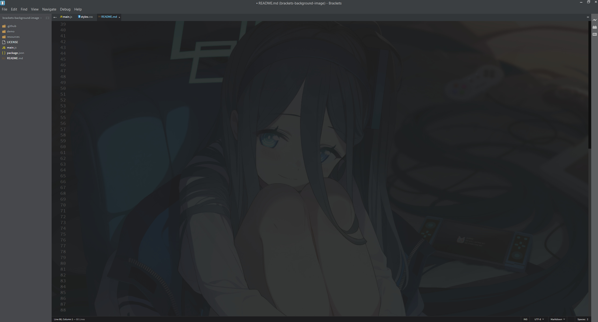

# Brackets Background Image

This extension lets you display a background image in the editor for [Brackets](https://brackets.io/) (now [Phoenix Code](https://phcode.io/#/home)).

----------

**Quick Links**
- [Demo](#demo)
- [How to Install](#how-to-install)
- [How to Modify the Background Image](#how-to-modify-the-background-image)


## Demo

[](demo/demo.jpg)


## How to Install

### Phoenix Code

https://phcode.dev/

1. Go to the extension manager.
2. Search "Brackets Background Image" under the "Available" tab.
3. Install "Brackets Background Image" and reload the editor if needed.
4. Enjoy background images while you code.

OR follow the steps below if not available on the store.


### Brackets

https://brackets.io/

1. [Download](https://github.com/SethClydesdale/brackets-background-image/archive/refs/heads/main.zip) or clone this repo locally.
2. Unzip Brackets Background Image and open Brackets.
3. Click "Help" (NOTE: this is under "Debug" in Phoenix Code) in the title bar and then "Show Extensions Folder" from the drop down.
4. Open the "user" folder and drop the brackets-background-image folder into the "user" folder.
5. Click "debug" in the title bar and then "Reload With Extensions" form the drop down.
6. Enjoy background images while you code.


## How to Modify the Background Images

Modifying the extension for your own use is fairly straightforward. Firstly open the extension folder in brackets, then open the **main.js** and **resources/styles.css** files.


### Randomization
In the **main.js** file you will see the variable **numberOfBackgrounds** which indicates the number of backgrounds you have in the **resources** folder. This number is used to randomly select the images in this folder to use as a background, so set it to however many images you have. If you want to disable randomization altogether, simply comment out the following line like in the example below using ``//``:

```javascript
// $('body').addClass('bg-' + (Math.floor(Math.random() * numberOfBackgrounds) + 1))
```


### Adding/Changing Backgrounds
To add new backgrounds, simply add whatever images you want to use as a background into the **resources** folder, then open the **styles.css** file.

In **styles.css**, add the following line of CSS to the file.

```css
.bg-1 .CodeMirror::before { background-image:url("FILE_NAME.jpg"); background-position:50% 50%; }
```

**.bg-1** is the number assigned to your background and used by the randomization in the previous section above. Increment this as needed. Now if you don't want to use a randomized background, simply remove this portion of the CSS. After this, you can rename **FILE_NAME.jpg** to use the correct file name and extension for your background, and adjust the background centering if necessary.

Lastly, by default the opacity of backgrounds is set to 0.1, feel free to adjust this to your liking by modifying the **opacity** property that's already in the stylesheet.

Once you have made the necessary changes, click "Debug" in the title bar and then "Reload With Extensions" to apply your changes.